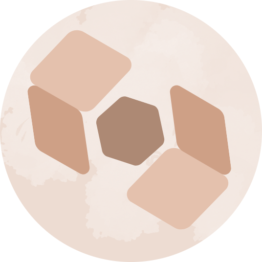

###

  
  
  

###

  
  
  

###

 

<h1 align="center">Portfolio Website</h1>

###

  

###

<h2 align="left">Introduction</h2>

###

A portfolio website showcasing my work

<h2 align="left">Technologies Used</h2>

###

The website It is developed using the framework Flutter.

###

<h2 align="left">Credits</h2>

###

Draw Over It is developed by me Yahya. I hope you enjoy the website. For support or feedback, please contact me above.

###
